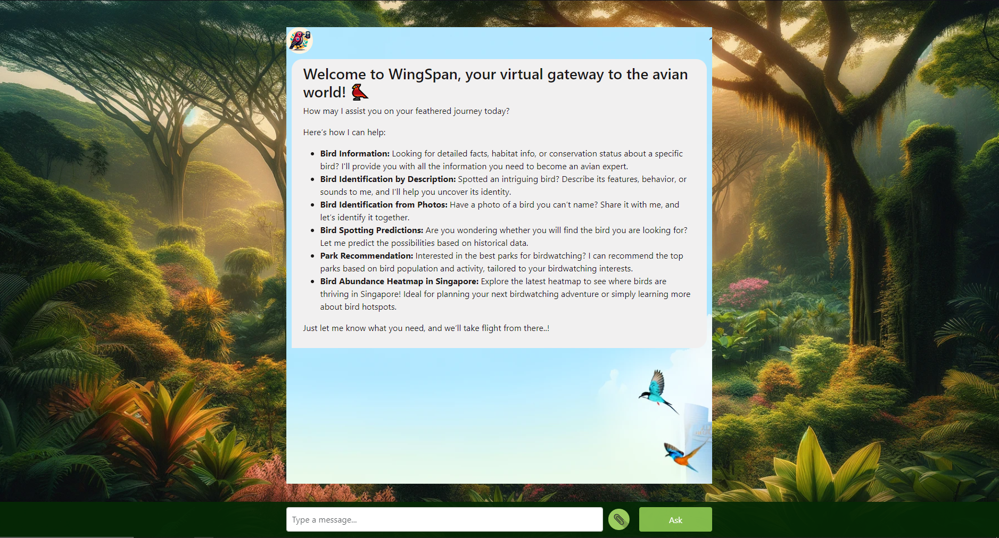

## WingSpan

WingSpan is an AI-driven platform designed to enhance birdwatching in Singapore by simplifying bird identification and locating birdwatching spots where it leverages the use of advanced AI and machine learning models to achieve the best performance.

------------
## PROJECT TITLE
### WingSpan - Enhancing Birdwatching with AI

------------

## EXECUTIVE SUMMARY

Despite Singapore's rich bird species, there is a lack of accessible tools for bird identification and locating birdwatching spots. Traditional methods are time-consuming, require expertise, and the available information on bird hotspots is often scattered and outdated. However, advancements in AI, including GPT-4 and machine learning models and other machine learning algorithms, offer a significant opportunity to revolutionize birdwatching. By leveraging these technologies, we created a user-friendly platform that simplifies bird identification and enables easy discovery of birdwatching spots, fostering a greater appreciation for Singapore's natural environment

#### SOLUTION
Our solution is an AI chatbot called WingSpan, which offers comprehensive functionalities:

• Bird Information: This feature provides users with extensive information about various bird species, including their habitat and conservation status, enabling users to expand their ornithological knowledge. \
• Bird Identification by Description: Users can input descriptions of birds they encounter, and the system will assist in identifying the species, aiding in the exploration and discovery of avian life. \
• Bird Identification from Photos: This feature allows users to upload photos of birds for identification, leveraging visual data for species recognition. \
• Bird Spotting Predictions: Utilizing historical data, the application predicts the likelihood of spotting specific birds, aiding enthusiasts in planning their birdwatching activities. \
• Park Recommendation: By analysing data on bird populations and activity, the system recommends parks for birdwatching. \
• Bird Abundance Heatmap in Singapore: An interactive heatmap feature displays areas of high bird abundance within Singapore, serving as a strategic tool for birdwatching planning.

------------

## Business Video and System Design Video

- Please find the video links in below text file or just click the thumbnails below to watch them:

text to video links

### Business Video Presentation

### System Design Video Presentation

---

## To Note:
- This public GitHub repository contains only data preparation scripts or miscellaneous scripts. The system code has not been open-sourced. For detailed information about the project workflow, please refer to the business and Technical system design video presentations.

---
